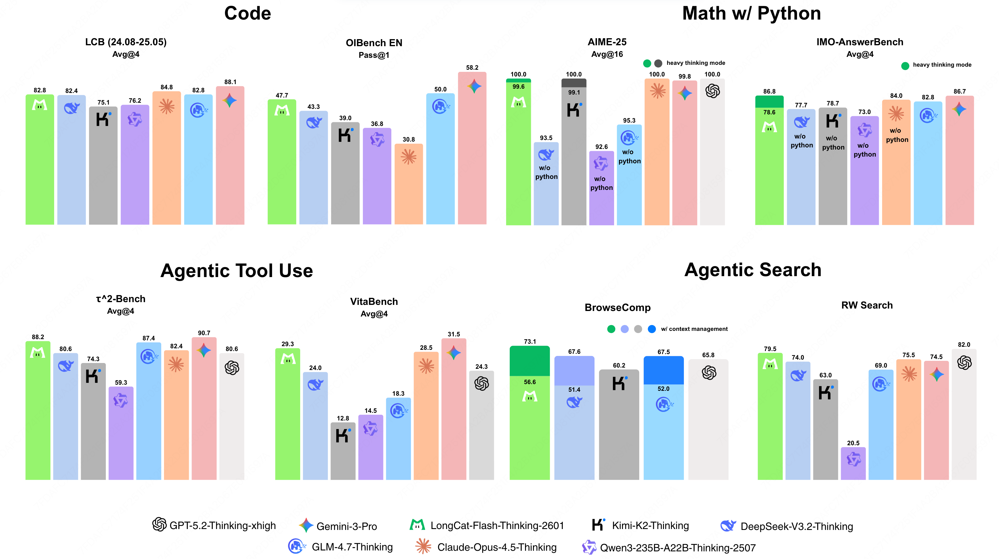

# LongCat-Flash-Thinking-2601

<div align="center">
  
</div>
<hr>


<div align="center" style="line-height: 1;">
  <a href="https://longcat.ai/" target="_blank" style="margin: 2px;">
    
  </a>
  <a href="https://huggingface.co/meituan-longcat" target="_blank" style="margin: 2px;">
    
  </a>
</div>

<div align="center" style="line-height: 1;">
  <a href="https://github.com/meituan-longcat/LongCat-Flash-Thinking-2601/blob/main/figures/wechat_official_accounts.png" target="_blank" style="margin: 2px;">
    
  </a>
  <a href="https://x.com/Meituan_LongCat" target="_blank" style="margin: 2px;">
    
  </a>
</div>

<div align="center" style="line-height: 1;">
  <a href="https://huggingface.co/meituan-longcat/LongCat-Flash-Thinking-2601/blob/main/LICENSE" style="margin: 2px;">
    
  </a>
</div>

<hr>
<div align="center" style="line-height: 1;">
  
</div>

## Model Introduction

We introduce an updated version of LongCat-Flash-Thinking, a powerful and efficient Large Reasoning Model (LRM) with 560 billion total parameters, built upon an innovative Mixture-of-Experts (MoE) architecture.  Beyond inheriting the domain-parallel training recipe in our previous version and maintaining highly competitive performance on traditional reasoning benchmarks, this update systematically strengthens agentic thinking capability through a carefully designed pipeline that combines environment scaling and subsequent task synthesis, followed by reliable and efficient large-scale and multi-environment reinforcement learning. To better adapt to the noise and uncertainty inherent in real-world agentic tasks, we conduct systematic analysis and curriculum training over multiple types and levels of environmental noise, enabling robust performance under imperfect conditions. As a result,  LongCat-Flash-Thinking achieves not only top-tier benchmark performance in agentic tool use, agentic search, and tool-integrated reasoning, but also substantially improved generalization in arbitrary out-of-distribution real-world agentic scenarios. We further design dedicated evaluation protocols to assess the robustness and generalization ability. In addition, we introduce our Heavy Thinking Mode, which further enhances the model’s performance on extremely challenging tasks via intensive parallel thinking.

### Key Features


#### 🌟 Environment Scaling and Multi-Environment Reinforcement Learning

We construct a diverse set of high-quality environments that serve as a training playground for reinforcement learning, enabling the model to acquire high-level, generalizable agentic skills. Each environment contains over 60 tools organized in a dense dependency graph, providing sufficient complexity for diverse task construction and large-scale exploration. As the number of training environments increases, we observe consistent improvements on out-of-domain evaluations, indicating strengthened generalization.

- **High Quality Task Construction.**  
  To ensure the quality of the training task set, we explicitly control both task complexity and diversity. Each task is defined over a connected subgraph sampled from a high-quality environment, and task complexity is controlled by requiring coordinated use of as many tools as possible within the sampled subgraph. The sampling probability of previously selected tools is progressively reduced to promote task diversity. We construct corresponding databases to ensure task executability, and each task is verified to admit at least one executable solution. However, when environments contain a large number of tools, maintaining consistency across databases becomes challenging and may lead to unverifiable tasks. Specialized strategies are designed to tackle this issue.

- **Multi-Environment Reinforcement Learning.**  
  While maintaining the efficient asynchronous training and streaming rollout features, we further extend our reinforcement learning infrastructure (DORA) to support large-scale multi-environment agentic training, as required by our environment scaling protocol. Tasks from multiple environments are jointly organized within each training batch in a balanced manner, and are allocated different rollout budgets based on both their complexity and the current training state.


#### 🌟 Robust Training against Noisy Environment

Since real-world agentic environments are inherently noisy and imperfect, training models only in idealized environments is insufficient and often results in limited robustness. To address this issue, we explicitly incorporate environmental imperfections into the model training process to enhance robustness. Specifically, we systematically analyze the major sources of real-world noise in agentic scenarios and then design an automatic pipeline to inject such noise into training environments. During reinforcement learning, we adopt a curriculum strategy that progressively increases both the type and the intensity of noise as training proceeds. Benefiting from our robust training, LongCat-Flash-Thinking develops strong resilience to environmental uncertainty and consistently achieves improved performance under imperfect conditions.

#### 🌟 Heavy Thinking Mode

To push reasoning capability beyond current boundary, we established our Heavy Thinking Mode. Specifically, we decompose challenging problem solving into two complementary stages: parallel thinking and summarization, thus jointly scaling both reasoning depth and width. For reasoning width scaling, under Heavy Thinking Mode, multiple trajectories are independently generated in a parallel manner, enabling broad exploration of reasoning paths. Reasonably high inference temperature here is applied to ensure possible diversity. For reasoning depth scaling, the refined trajectories during the summarization stage can be recursively fed back into the summary model, forming an iterative reasoning loop that supports progressively deeper reasoning. An additional reinforcement learning stage is specifically tailored to train the summarization ability, thus further unlocking the potential of this mode.

We've launched Heavy Thinking Mode on the Longcat AI platform. Feel free to try it out: [https://longcat.chat/](https://longcat.chat/). 

## Evaluation Results

| **Benchmark** | DeepSeek-V3.2-Thinking | Kimi-K2-Thinking | Qwen3-235B-A22B-Thinking-2507 | GLM-4.7-Thinking | Claude-Opus-4.5-Thinking | Gemini-3-Pro | GPT-5.2-Thinking-xhigh | LongCat-Flash-Thinking-2601 |
|---------------|------------------------|------------------|-------------------------------|------------------|---------------------------|--------------|------------------------|------------------------------|
| Architecture | MoE | MoE | MoE | MoE | - | - | - | MoE |
| # Total Params | 671B | 1T | 235B | 355B | - | - | - | 560B |
| # Activated Params | 37B | 32B | 22B | 32B | - | - | - | 27B |
| **Mathematical Reasoning w/ Tools** | | | | | | | | |
| AIME-25 (Avg@16) | 93.5* | 99.1† | 92.6* | 95.3* | **100.0** | 99.8 | **100.0** | <u>99.6</u> / **100.0**‡ |
| HMMT-25 (Avg@16) | 93.5* | 95.1† | 83.9* | <u>98.1</u>* | 98.6 | **99.8** | 99.6 | 93.4 / 97.5‡ |
| IMO-AnswerBench (Avg@4) | 77.7* | 78.7* | 73.0* | 84.0* | 82.8 | 86.7 | - | 78.6 / **86.8**‡ |
| AMO-Bench EN (Avg@16) | 51.9* | 56.0* | 47.8* | 62.4* | 66.0 | **72.5** | - | 61.6 / <u>66.0</u>‡ |
| AMO-Bench CH (Avg@16) | 52.0* | 51.8* | 28.8* | 35.1* | 67.7 | **74.9** | - | 56.8 / <u>67.5</u>‡ |
| **Agentic Search** | | | | | | | | |
| BrowseComp (Pass@1) | 51.4 / 67.6† | - / 60.2† | - | 52.0 / 67.5† | - | - | **65.8** / - | <u>56.6</u> / **73.1** |
| BrowseComp-zh (Pass@1) | 65.0 / - | - / 62.3† | - | 66.6 / - | - | - | - | **69.0** / **77.7** |
| RW Search (Pass@1) | 74.0 | 63.0 | 20.5 | 69.0 | 75.5 | 74.5 | **82.0** | <u>79.5</u> |
| **Agentic Tool Using** | | | | | | | | |
| τ²-Retail (Avg@4) | 81.8† | - | 71.9† | - | **88.9**† | - | 82.0† | <u>88.6</u> |
| τ²-Airline (Avg@4) | 63.8† | - | 58.6† | - | - | - | - | **76.5** |
| τ²-Telecom (Avg@4) | 96.2† | - | 47.3 | - | 98.2† | - | 98.7† | **99.3** |
| τ²-Avg (Avg@4) | 80.6 | 74.3† | 59.3 | 87.4† | 82.4 | **90.7**† | 80.6 | <u>88.2</u> |
| τ²-Noise (Avg@4) | 64.1 | 63.1 | 44.3 | 66.0 | 59.4 | 57.3 | 65.0 | **67.1** |
| VitaBench (Avg@4) | 24.0 | 12.8 | 14.5 | 18.3 | 28.5 | **31.5** | 24.3 | <u>29.3</u> |
| VitaBench-Noise (Avg@4) | 14.0 | 9.2 | 6.5 | 10.8 | 20.3 | **20.8** | 19.0 | <u>20.5</u> |
| Random Complex Tasks (Avg@4) | 32.5 | 29.7 | 32.7 | 25.3 | 32.6 | 32.5 | 17.2 | **35.8** |
| **General QA** | | | | | | | | |
| HLE text-only (w/o tools) | 24.1 | 24.4 | 17.8 | <u>26.9</u> | 32.0 | **40.3** | 34.5† | 25.2 |
| GPQA-Diamond (Avg@16) | <u>86.9</u> | 85.4 | 80.5 | 84.9 | 86.9 | 91.9 | **92.9** | 80.5 / 85.2‡ |
| **Coding** | | | | | | | | |
| LCB (24.08–25.05) (Avg@4) | 82.4 | 75.1 | 76.2 | <u>84.8</u> | 82.8 | **88.1** | - | 82.8 |
| OJBench (Pass@1) | 41.8 | 42.3 | 35.6 | <u>44.6</u> | 46.7 | **61.2** | - | 42.2 |
| OIBench EN (Pass@1) | 43.3 | 39.0 | 36.8 | 30.8 | 50.0 | **58.2** | - | <u>47.7</u> |
| SWE-bench Verified (Avg@5) | 73.1 | 71.3 | - | <u>73.8</u> | **80.9** | 76.2 | 80.0 | 70.0 |


Note:
- Values marked with † are sourced from other public reports.
- ‡ indicates the score obtained using our Heavy Thinking mode.
- \* indicates that the result with tools is unavailable, and thus the corresponding result without tools is reported instead.
- For BrowseComp-zh, due to a high error rate in the original annotations, we manually revised the answers for 24 cases.
- For the τ²-Airline domain, we adopt the fixes to the environment as proposed in the Claude Opus 4.5 release report.
- For BrowseComp, performance is reported both without and with the context management technique.
- The Noise benchmarks are constructed by injecting environmental noise into existing benchmarks to better approximate real-world agentic environments, and are used to evaluate the model's robustness.
- Random Complex Tasks refers to randomly constructed environments, and are used to evaluate the model's generalization capability, which we detail below.


## Evaluation in Random Complex Tasks

We propose a novel approach to evaluate the generalization ability of agentic models. Specifically, we build an automated synthesis pipeline that allows users to randomly generate complex tasks for arbitrary scenarios given a set of keywords. Each generated task is equipped with a corresponding tool set and an executable environment. Since the tools in these environments are highly randomized, we evaluate the model’s performance in such environments to assess its generalization capability. LongCat consistently achieves superior performance under these settings, demonstrating strong generalization ability in agentic scenarios. We also provide a [video demo](https://youtu.be/zc_OIhxFMFw) for illustration.

<div align="center">
  <a href="https://youtu.be/zc_OIhxFMFw" target="_blank">
    
  </a>
</div>


## Quick Start

### Chat Template Overview

To support advanced tool-use scenarios and sophisticated reasoning paradigms, we have introduced significant updates to our chat template, as defined in the `tokenizer_config.json` file. 

#### Basic Usage
The chat template can be applied using the ```apply_chat_template``` method. Below is a standard implementation:

```python
text = tokenizer.apply_chat_template(
    messages,
    tools=tools,
    tokenize=False,
    enable_thinking=True,
    add_generation_prompt=True,
    save_history_reasoning_content=False
)
```

#### Key Features
*   **Tool Declaration:** Available tools are declared at the beginning of the session to activate the model's tool-use capabilities and define the scope of available actions.
*   **Interleaved Thinking:** By default, the template employs an interleaved thinking approach. In this mode, the final response is preserved while thinking content from previous user interactions is discarded to maintain a concise context window. Tool calls and responses are retained to provide necessary execution history.
*   **Reasoning Retention:** If you need to preserve the model's thinking content across turns, you can enable this by setting `save_history_reasoning_content=True`.

#### Implementation Examples

##### 1. Multi-Turn Dialogue
This example demonstrates how the template handles conversational history and thinking content.

```python
from transformers import AutoModelForCausalLM, AutoTokenizer

model_name = "meituan-longcat/LongCat-Flash-Thinking"

# Load the tokenizer and the model
tokenizer = AutoTokenizer.from_pretrained(model_name)

messages = [
    {"role": "system", "content": "You are a helpful assistant."},
    {"role": "user", "content": "Please tell me what is $$1 + 1$$ and $$2 \times 2$$?"},
    {"role": "assistant", "reasoning_content": "This question is straightforward: $$1 + 1 = 2$$ and $$2 \times 2 = 4$$.", "content": "The answers are 2 and 4."},
    {"role": "user", "content": "Check again?"}
]

text = tokenizer.apply_chat_template(
    messages,
    tokenize=False,
    enable_thinking=True,
    add_generation_prompt=True,
    save_history_reasoning_content=False # Discard reasoning history to save tokens
)

# Template Output Structure:
# <longcat_system>You are a helpful assistant.<longcat_user>Please tell me what is $$1 + 1$$ and $$2 \times 2$$?<longcat_assistant>The answers are 2 and 4</longcat_s><longcat_user>Check again? /think_on <longcat_assistant><longcat_think>\n

model_inputs = tokenizer([text], return_tensors="pt").to(model.device)

# Generate response
generated_ids = model.generate(
    **model_inputs,
    max_new_tokens=32768
)
output_ids = generated_ids[0][len(model_inputs.input_ids[0]):].tolist() 

print(tokenizer.decode(output_ids, skip_special_tokens=True).strip("\n"))

# Example Output:
# The user wants a double-check. Since $$1 + 1 = 2$$ and $$2 \times 2 = 4$$ are basic arithmetic truths, the previous answer is correct.\n</longcat_think>\nI have verified the calculations: $$1 + 1 = 2$$ and $$2 \times 2 = 4$$. The initial answer remains correct.</longcat_s>
```

##### 2. Tool Calling
This example illustrates how to integrate function calling within the reasoning framework.


```python
tools = [
    {
        "type": "function",
        "function": {
            "name": "func_add",
            "description": "Calculate the sum of two numbers",
            "parameters": {
                "type": "object",
                "properties": {
                    "x1": {"type": "number", "description": "The first addend"},
                    "x2": {"type": "number", "description": "The second addend"}
                },
                "required": ["x1", "x2"]
            }
        }
    }
]

messages = [
    {"role": "system", "content": "You are a helpful assistant."},
    {"role": "user", "content": "Please tell me what is $$125679 + 234519$$?"},
    {
        "role": "assistant", 
        "reasoning_content": "This calculation requires precision; I will use the func_add tool.", 
        "tool_calls": [{"type": "function", "function": {"name": "func_add", "arguments": {"x1": 125679, "x2": 234519}}}]
    },
    {"role": "tool", "name": "func_add", "content": '{"ans": 360198}'}
]

text = tokenizer.apply_chat_template(
    messages,
    tools=tools,
    tokenize=False,
    enable_thinking=True,
    add_generation_prompt=True,
    save_history_reasoning_content=False
)

model_inputs = tokenizer([text], return_tensors="pt").to(model.device)

# Generate response based on tool result
generated_ids = model.generate(
    **model_inputs,
    max_new_tokens=32768
)
output_ids = generated_ids[0][len(model_inputs.input_ids[0]):].tolist() 

print(tokenizer.decode(output_ids, skip_special_tokens=True).strip("\n"))

# Example Output:
# The tool returned $$360198$$. Therefore, $$125679 + 234519 = 360198$$.\n</longcat_think>\nThe sum of $$125679$$ and $$234519$$ is $$360198$$.</longcat_s>
```

## Deployment

We have implemented basic adaptations in both SGLang and vLLM to support the deployment of LongCat-Flash-Thinking-2601. Please refer to the [Deployment Guide](docs/deployment_guide.md) for detailed deployment instructions.


## Chat Website

You can chat with LongCat-Flash-Thinking-2601 on our official website: [https://longcat.ai](https://longcat.ai).
Please turn on the button "Think" ("深度思考" in Chinese) before submitting your request.


## License Agreement

The **model weights** are released under the **MIT License**. 

Any contributions to this repository are licensed under the MIT License, unless otherwise stated. This license does not grant any rights to use Meituan trademarks or patents. 

See the [LICENSE](LICENSE) file for the full license text.

## Usage Considerations 
This model has not been specifically designed or comprehensively evaluated for every possible downstream application. 

Developers should take into account the known limitations of large language models, including performance variations across different languages, and carefully assess accuracy, safety, and fairness before deploying the model in sensitive or high-risk scenarios. 
It is the responsibility of developers and downstream users to understand and comply with all applicable laws and regulations relevant to their use case, including but not limited to data protection, privacy, and content safety requirements. 

Nothing in this Model Card should be interpreted as altering or restricting the terms of the MIT License under which the model is released. 

## Contact
Please contact us at <a href="mailto:longcat-team@meituan.com">longcat-team@meituan.com</a> or join our WeChat Group if you have any questions.

#### WeChat Group

